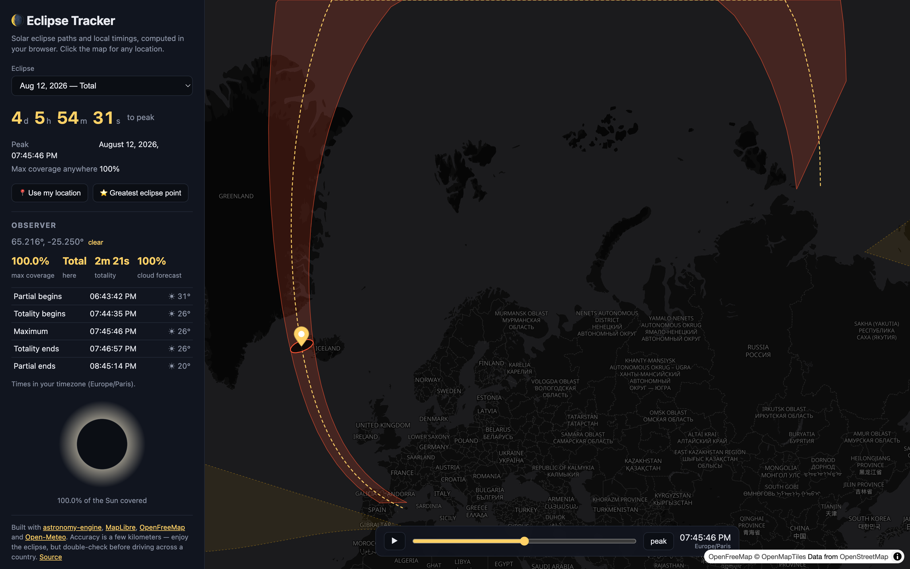

# Eclipse Tracker

Interactive solar eclipse map: **[eclipse.stanislas.cloud](https://eclipse.stanislas.cloud)**

Pick an eclipse (2023–2035), watch the Moon's shadow sweep across the Earth, and click
anywhere to get local timings: contact times, coverage, totality duration, sun altitude —
plus a cloud-cover forecast when the eclipse is close.



## How it works

There is no backend and no data files. Everything is computed in the browser from
ephemerides with [astronomy-engine](https://github.com/cosinekitty/astronomy):

```
                    Sun ☀
                     \
                      \  shadow axis (Sun → Moon center)
                   Moon ●
                      \ \
                 umbra \ \ penumbra
                        \ \
Earth ellipsoid ─────────▼──────────
                         E  ← axis ∩ WGS84 = shadow center
```

- **Catalog** — enumerate all solar eclipses 2023–2035 (`SearchGlobalSolarEclipse`).
- **Path of totality** — sample the eclipse around its peak; at each instant, intersect
  the Sun–Moon axis with the WGS84 ellipsoid, derive the umbra cone radius from similar
  triangles, offset perpendicular to the track, and re-project. Gives the center line and
  the north/south limits (`src/lib/shadow.ts`).
- **Animated shadow** — same math per animation frame: project the umbra/penumbra cone
  rim onto the ellipsoid and draw the footprint rings on the map.
- **Local circumstances** — `SearchLocalSolarEclipse` for the clicked point: C1–C4
  contact times, obscuration, sun altitude. The sky simulation compares topocentric
  angular radii and separation of the two discs.
- **Clouds** — [Open-Meteo](https://open-meteo.com) hourly cloud cover, when the eclipse
  is within the 16-day forecast horizon.

The shadow math is validated in `src/lib/shadow.test.ts` against astronomy-engine's own
greatest-eclipse predictions (< 0.5° difference). Overall accuracy is a few kilometers:
great for a map, not for planning an expedition to the edge of the path.

## Stack

- React + TypeScript + Vite, [MapLibre GL](https://maplibre.org) with
  [OpenFreeMap](https://openfreemap.org) dark tiles
- Deployed as static assets on a Cloudflare Worker, auto-deployed from `main` by
  Workers Builds

## Develop

```sh
bun install
bun run dev     # local dev server
bun run check   # typecheck + tests
```

## Deploy

Pushes to `main` build and deploy automatically. Manual deploy: `bun run deploy`.

## License

MIT
